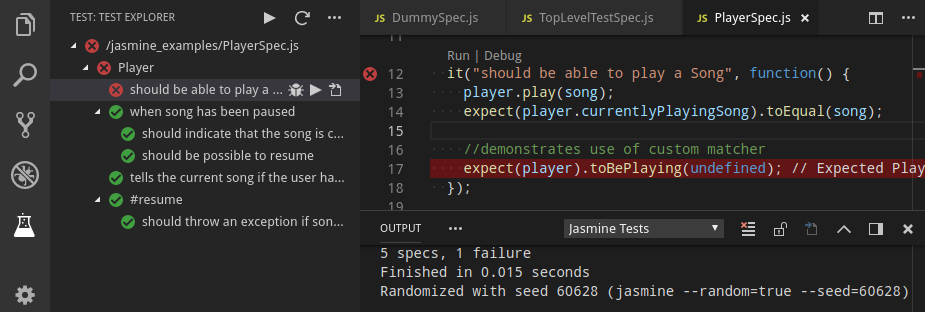

# Jasmine Test Explorer for Visual Studio Code

Run your Jasmine tests using the 
[Test Explorer UI](https://marketplace.visualstudio.com/items?itemName=hbenl.vscode-test-explorer).

## Features
* Shows a Test Explorer in the Test view in VS Code's sidebar with all detected tests and suites and their state
* Adds CodeLenses to your test files for starting and debugging tests
* Adds Gutter decorations to your test files showing the tests' state
* Shows a failed test's log when the test is selected in the explorer
* Lets you choose test suites or individual tests in the explorer that should be run automatically after each file change

## Getting started
* Install the extension
* Restart VS Code and open the Test view
* Run / Debug your tests using the  /  icons in the Test Explorer or the CodeLenses in your test file

## Configuration

* `jasmineExplorer.config`: The location of the Jasmine config file (relative to the workspace folder) (default: `spec/support/jasmine.json`)
* `testExplorer.codeLens`: Show a CodeLens above each test or suite for running or debugging the tests
* `testExplorer.gutterDecoration`: Show the state of each test in the editor using Gutter Decorations
* `testExplorer.onStart`: Retire or reset all test states whenever a test run is started
* `testExplorer.onReload`: Retire or reset all test states whenever the test tree is reloaded
